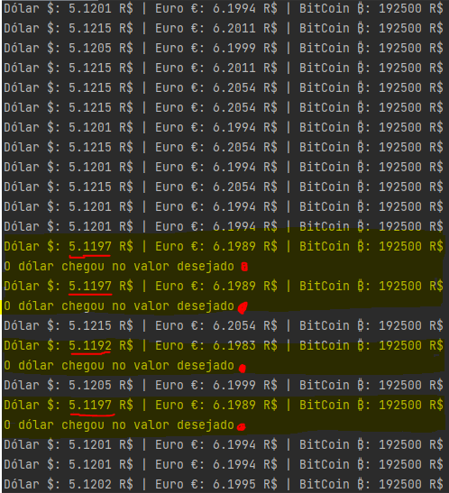

## Bolsa de valores

### Descrição do Projeto
Cotações de três moedas (Dólar, Euro e Bitcoin) em tempo real utilizando uma API gratuita com notificações quando atinge valores desejados.

### 📑 Funcionalidades

- [x] Cotação em tempo real: Dólar, Euro e Bitcoin.
- [x] Atualização dos valores sem precisar reiniciar o programa.
- [ ] Enviar sms quando uma determinada moeda chegar no valor desejado.

### 📌 Pré-requisitos
Antes de começar, você vai precisar ter instalado em sua máquina as seguintes ferramentas: [Git](https://git-scm.com) e [Python](https://www.python.org/). Além disto é bom ter um editor para trabalhar com o código como [VSCode](https://code.visualstudio.com/) ou [PyCharm](https://www.jetbrains.com/pt-br/pycharm/download/).

#### Instalar a biblioteca "Requests":
```bash
$ pip install requests
```
#### Link para importar a API 
```bash
$ https://economia.awesomeapi.com.br/last/USD-BRL,EUR-BRL,BTC-BRL
```
### 💻 Demonstração de aplicação

<h4 align="center">   
<h4 align="center"> 
Exemplo de notificação quando o valor atingisse < 5.12 (cotações do dia 11/06/2021)
</h4>
</h4>
<p align="center">
  
</p>

<h4 align="center">   
<h4 align="center"> 
🚧  Status do projeto: Em construção 🚧
</h4>
</h4>
